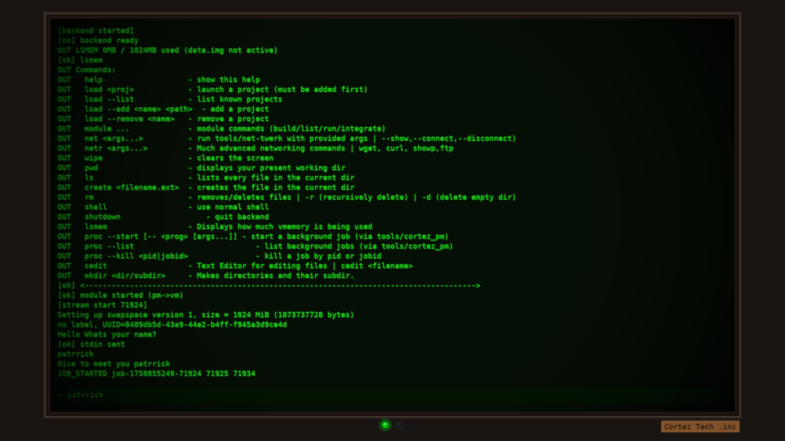

#Title
Cortez CRT Terminal

#Description
- A CRT Based Retro Terminal made in C.

#Usage

- Go to the bin folder.
- Do a sudo ./cortez_frontend_crt
- Enjoy

#Dependencies

- This Terminal relies on SDL2 to display it's terminal so you must have SDL2 installed
and You must create a 1gb Disk image before you start or else you wont be able to run any process at all, 
- To make the disk image: dd if=/dev/zero of=data.img bs=1M count=1024,
- Then: mv data.img tools
- Then cd bin && sudo ./cortez_frontend_crt
- The disk image has to be named data.img, and the size is 1024 mb.
- Then store the disk image inside the tools folder

#Developer

- Developed by Patrick Andrew Cortez, A third year Computer Engineering Student

#Compile
- To compile any major parts that might be missing (e.g frontend or network manager):

- Take a look in the run.txt folder, and there are instructions on how to compile each.

Preview:

